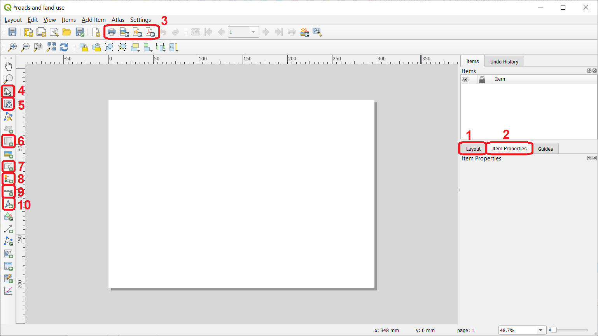
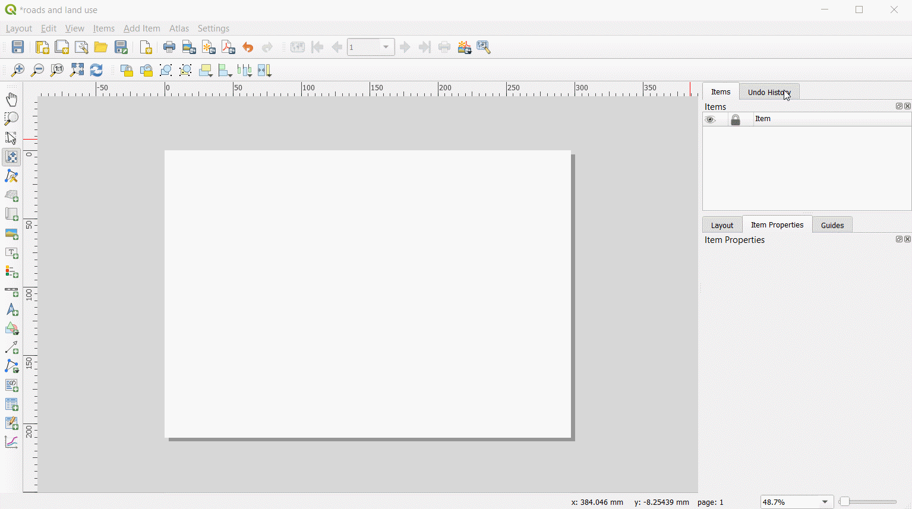
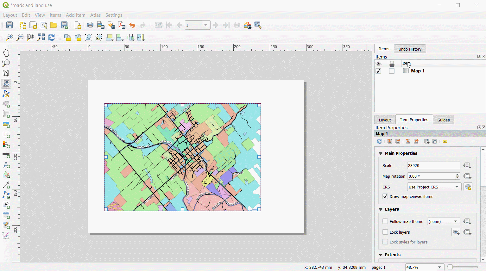
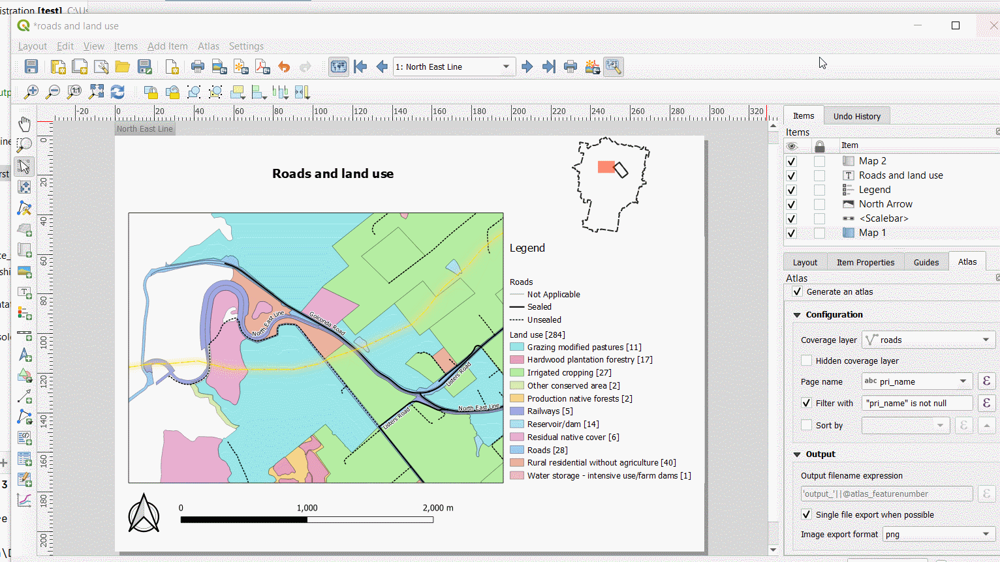

Cartographic outputs
====================

At some point in a GIS workflow, you will want to produce maps for printing.
This exercise will introduce you to the basic concepts of behind the ``Print layout`` the tool used in QGIS to produce printing layouts for maps.

.. admonition:: Resources

   This exercise uses the same dataset used for the *Spatial relationships. If you need to download the data again just clik on `this link <https://canvas.utwente.nl/courses/6395/files/1773079/download?download_frd=1/>`_. The dataset contains the following layers:

   - *dorset_cadaster.qgz* a QGIS project preloading a *geopackage* containing the following layers:

      - *roads* (road network)
      - *water_plan* (area a water management plan where special provisions may apply)
      - *power_line_project* (proposed route for a high voltage aereal cable)
      - *parcels* (the cadaster)
      - *land_use* (land uses as of 2015)
      - *parish* (admninistrative boundary of the parishes within the Dorset municipality - Tasmania)
      - *party* (fictional list of parties)
      - *building* (empty layer of type polygon)
      - *topographic_map* (a sample topographic map generated from Open Street Map)
      - *building_type* (fictional list of types of buildings)

    In additon to the project and respective datasets, there are also folders with auxiliary files the exercise may refer to.

Preparing a map
---------------

The first thing you need is to actually have a `cartographic visualization <https://ltb.itc.utwente.nl/page/481/concept/78826/>`_ you want to share. To keep things simple, we will be using just two layers: ``land_use`` and  ``roads``.

1. **Task** style the layers in any manner you wish. In this example we are using a ``Cagegorized`` style for both layers. In the case of ``land_use``, field ``LU_DESCRIP`` is used to generate the categories, in the case of ``roads`` the attribute being used is ``surface_ti``. In addition, the ``roads`` layer is being labeled using the attribute ``pri_name``.

.. attention::

    If you don't want to spend time styling the roads layer, you also import the style file ``roads.qml``. You will find it under the folder ```styles``. You can do that from the bottom of the ``Layer properties`` dialog where you will see a button named ``Style``


Configuring a print layout
--------------------------

Now that the layers you need for your map are according to what you want, we will start working on preparing a print layout.

2. **Task** Go to ``Project`` > ``New print layout`` and provide a name for the map layout you are about to create. We suggest you name it ``roads and land use``.

Upon pressing he ``OK`` button, the ``Print layout`` window will open. Lets start by understanding the main elements of this tool :numref:`print_layout`.

.. _print_layout:


   The ``Print layout``


* [1] Under ``Layout``, you will find options that apply to the layout, like for example page size, DPI,etc;

* [2] In contrast, under ``Item properties`` you will find options that affect only the **currently selected object** (see point 4);

* [3] Here you will find options to print and export your map once you are done with the layout;

* [4] This is the ``Select/Move item``. Use it to select elements of your map, like scale bars, legends, etc;

* [5] The ``Add map`` tool allows you to adjust the extend of the map (see next point);

* [6] With the ``Add map``, you draw a rectangle that will work as a container for your map. By default your map will be the result of comnining the currently visible layers in QGIS;

* [7] The ``Add label`` tool. With it you can place a text box anywhere in your layout;

* [8] The ``Add legend`` will automatically build a map legend from the set of visible layers. Most of the time you will want to tweak it further;

* [9] The ``Scale bar`` adds a legend to your map;

* [10] Finally, the ``North arrow`` will add a north arrow.


.. attention::

   For a complete overview of the ``Print layout`` check the `official documentation <https://docs.qgis.org/testing/en/docs/user_manual/print_composer/overview_composer.html/>`_

Add a map to the layout
^^^^^^^^^^^^^^^^^^^^^^^

3. **Task** Start by usig the ``Add map`` tool to add a map to your composition. Adjust if necessary with the ````Select/Move item`` tool :numref:`add_map`.

.. _add_map:


   Adding a map to the layout

Add legend, scale bar and a north arrow
^^^^^^^^^^^^^^^^^^^^^^^^^^^^^^^^^^^^^^^

4. **Task** Add other basic elements of your map: a legend, a scale bar and a north arrow :numref:`add_elements`.

.. _add_elements:


   Adding map elements

5. **Task** Try to add an *overview* map! Use the ``Item properties`` panel of each of the elements you have in the map to do the adjustments you consider necessary. Take your time to explore the options each type of item offers.


            * On the ``Item properties`` of your first map, mark the options ``Lock layers`` and ``Lock styles``;


            * Go back to QGIS and turn all layers off EXCEPT ``parish``;


            * Return to the ``Print layout`` window and add a second, smaller, map box. Adjust the scale so that the whole ``parish`` layer is visible and then check the ``Lock layers`` and ``Lock styles`` options.


            * Still while at the ``Item properties`` of the second map (the overview map) go to the ``Overviews`` section and set the map as an overview of ``Map1`` :numref:`setting_an_overview_map`.

            .. _setting_an_overview_map:
            .. figure:: _static/images/print_layouts/setting_an_overview_map.png
               :alt: setting_an_overview_map
               :figclass: align-center

               Defining an overview map

Depending on how you set your map and the options you choose under each of the objects ``Item properties``, your map might be looking something like :numref:`map_layout`:

.. _map_layout:
.. figure:: _static/images/print_layouts/map_layout.png
   :alt: map layout
   :figclass: align-center

   Final map layout

.. attention::

    This exercise is just and introduction to map layouting in QGIS - further details depend on how deep you are willing to explore. The example we are reproducing here should get you started with the basic mechanics of the ``Print layout``.


The Atlas
---------

The ``Atlas`` is an interesting feature of the ``Print layout`` of QGIS. It offers the possibility of automatizing the production of maps according to a coverage layer.
This coverage layer can be any feature, but the classic example is an administrative unit. Essentially, what the Atlas does is to apply the layout we have been
working on to X maps according to the number of features in the coverage layer. Once this is done we can print those X maps in one go.

For our example, the coverage layer will be the ``roads`` layer. This means evey road in that dataset will define the extents of one of the maps of the Atlas.
There are 580 roads in the dataset, therefore we can have to up 580 maps, or pages, in our Atlas.

6. **Task** From the ``Print layout`` window, click on ``Atlas`` an then on ``Atlas settings``. An extra tab, named ``Atlas`` will be showing next to the ``Layout properties`` and ``Item properties``.


7. **Task** In the ``Atlas`` tab, enter the following options :numref:`atlas_settings`:

            * Start by checking the option ``Generate and Atlas``;


            * Set the ``roads`` as the coverage layer;


            * Under ``Page name`` enter *pri_name*;


            * Finally, under ``Filter`` enter the expression  *"pri_name" is not null* (this will make our Atlas a bit lighter by excluding the generation of a map for roads with no name)


            .. _atlas_settings:
            .. figure:: _static/images/print_layouts/atlas_settings.png
               :alt: atlas_settings
               :figclass: align-center

               The Atlas settings

9. **Task** Now go to the ``Item properties`` of the main map (Map 1) and check the option ``Controlled by Atlas``

10. **Task** Now click on the ``Preview Atlas`` button and use the arrows to preview the maps that make up the atlas :numref:`previewing_atlas`.

.. _previewing_atlas:


   Previewing the Atlas


Printing and exporting
----------------------

You can print and/or export a single map or the full Atlas to one of these formats: **PDF**, **Image (.png, .jpg, etc)** or **SVG**.
Just keep in mind that the export buttons are different depending on if you are exporting a single map or a full atlas :numref:`exporting_maps`

.. _exporting_maps:
.. figure:: _static/images/print_layouts/exporting_maps.png
   :alt: exporting_maps
   :figclass: align-center

   Print and export options

From the ``Layout`` menu, you can also save your layout as template to be used in other projects.