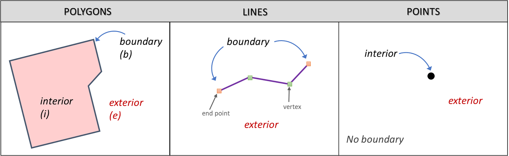

Spatial relationships
======================

A GIS works with data whose location is known. This means we can use Tobler's first law of geography *‘Everything is related with everything, but near things are more related than distant things’* to discover how objects relate to each other in space.
The predicates used to describe those relationships are known as ``Spatial relantionships``.

The structure of a geometry
---------------------------

In order to take full advantage of the spatial relantionships predicates, we have to understand how a geometry is stored in a GIS system
To do that we have to understand that every geometry as an exterior, and interior and a boundary (:numref:`topo-fundamentals`). The importance of these concepts will become clearer ahead.

.. _topo-fundamentals:

   The boundary, interior and exterior of polygons, lines and points.

Types of spatial relationships
-------------------------------

The most generic spatial relantionship is the ``intersection``, defined as any space shared by two geometries. This means counter intuitive results like the intersection between two polygons returning a point is a possibility.
All the other spatial relationships are specific types of intersection.

.. _Overview of spatial relationships:
.. csv-table:: Overview of spatial relationships
   :file: _static/csv/spatial_relastionships.csv
   :widths: 10, 35
   :header-rows: 1

.. attention::
     Spatial relationships must not be confused with ``overlay operations``. The former are primarily a logical test, while the latter consist of geoprocessing operations that produce a new dataset
     resulting from overlaying two datasets. This overlay may be based on a spatial relationship though.

Exercise
--------

.. admonition:: Resources

   | For this exercise you will need this `dataset <https://canvas.utwente.nl/files/1758642/download?download_frd=1/>`_. The dataset contains the following layers:

   - *spatial_relationships.qgs* a QGIS project preloading a *geopackage* containing the following layers:

      - *lines* (just some lines)
      - *points* (just some points)
      - *polygons* (just some polygons)

#. **Task** Open the QGIS project and observe the map. WITHOUT using the software, try to fill in the table below keeping in mind the definitions given in :numref:`Overview of spatial relationships`.

.. csv-table:: Spatial relationships outcomes
   :file: _static/csv/spatial_relationships_exercise.csv
   :widths: 50, 50
   :header-rows: 1

#. **Task** From the ``Processing toolbox`` use the ``Select by location`` (:numref:`select_by_location`) tool to verify your answers.

.. _select_by_location:
.. figure:: _static/images/spatial_relantionships/select_by_location.png
   :alt: vector_data_model
   :scale: 50 %
   :figclass: align-center

   The select by location tool