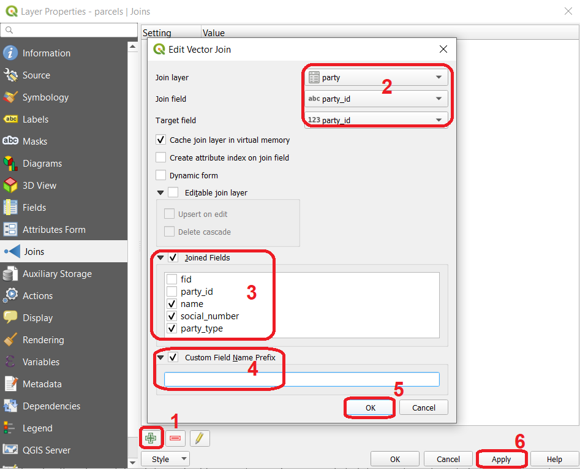

Spatial relationships
======================

A GIS works with data whose location is known. This means we can use Tobler's first law of geography *‘Everything is related with everything, but near things are more related than distant things’* to discover how objects relate to each other in space.
The predicates used to describe those relationships are known as ``Spatial relantionships``.

The structure of a geometry
---------------------------

In order to take full advantage of the spatial relantionships predicates, we have to understand how a geometry is stored in a GIS system
To do that we have to understand that every geometry as an exterior, and interior and a boundary (:numref:`topo-fundamentals`). The importance of these concepts will become clearer ahead.

.. _topo-fundamentals:
.. figure:: _static/images/spatial_relantionships/topo-fundamentals.png
   :alt: vector_data_model
   :scale: 50 %
   :figclass: align-center

   The boundary, interior and exterior of polygons, lines and points.

Types of spatial relationships
-------------------------------

The most generic spatial relantionship is the ``intersection``, defined as any space shared by two geometries. This means counter intuitive results like the intersection between two polygons returning a point is a possibility.
All the other spatial relationships are specific types of intersection.

.. _Overview of spatial relationships:
.. csv-table:: Overview of spatial relationships
   :file: _static/csv/spatial_relastionships.csv
   :widths: 10, 35
   :header-rows: 1

.. attention::
     Spatial relationships must not be confused with ``overlay operations``. The former are primarily a logical test, while the latter consist of geoprocessing operations that produce a new dataset
     resulting from overlaying two datasets. This overlay may be based on a spatial relationship though.

.. admonition:: Resources

   | For this exercise you will need this `dataset <https://github.com/andremano/GIS-4-Land-Administration/raw/master/_static/datasets/spatial_relationships.zip/>`_. The dataset contains the following layers:

   - *spatial_relationships.qgz* a QGIS project preloading a *geopackage* containing the following layers:

      - *lines* (just some lines)
      - *points* (just some points)
      - *polygons* (just some polygons)

1. **Task** Open the QGIS project and observe the map. WITHOUT using the software, try to fill in :numref:`Spatial relationships outcomes` keeping in mind the definitions given in :numref:`Overview of spatial relationships`.

.. _Spatial relationships outcomes:
.. csv-table:: Spatial relationships outcomes
   :file: _static/csv/spatial_relationships_exercise.csv
   :widths: 50, 50
   :header-rows: 1

2. **Task** From the ``Processing toolbox`` use the ``Select by location`` (:numref:`select_by_location`) tool to verify your answers.

.. _select_by_location:
.. figure:: _static/images/spatial_relantionships/select_by_location.png
   :alt: select by location
   :scale: 50 %
   :figclass: align-center

   Select by location

.. admonition:: Resources

Joins
-----

.. admonition:: Resources

   For this exercise you need to download `this dataset <https://canvas.utwente.nl/courses/6395/files/1773079/download?download_frd=1/>`_. The dataset contains the following layers:

   - *dorset_cadaster.qgz* a QGIS project preloading a *geopackage* containing the following layers:

      - *roads* (road network)
      - *water_plan* (area a water management plan where special provisions may apply)
      - *power_cable_(plan)* (proposed route for a high voltage aereal cable)
      - *parcels* (the cadaster)
      - *land_use* (land uses as of 2015)
      - *parish* (admninistrative boundary of the parishes within the Dorset municipality - Tasmania)
      - *party* (fictional list of parties)
      - *building* (empty layer of type polygon)
      - *topographic_map* (a sample topographic map generated from Open Street Map)
      - *building_type* (fictional list of types of buildings)

    In additon to the project and respective datasets, there are also folders with auxiliary files the exercise may refer to.

Often the information we need is scattered through more that one table. when that happens we have to resort to ``joins``. There are two types of joins: the `join by attribute` and the ``join by location``.

A join simply binds information together based on a common attribute. To demonstrate this idea, we will first perform a ``join by attribute``

3. **Task** Go to the layer properties ``parcels`` layer, and under the ``Joins`` tab, define a join as illustrated in (:numref:`join_by_attributes`).

.. _join_by_attributes:

   Join by attributes

After defining this join, if you open the attribute table of the layer ``parcels``, you should observe that it now has three extra attributes (:numref:`join_by_attributes_table`).

.. _join_by_attributes_table:
.. figure:: _static/images/spatial_relantionships/join_by_attributes_table.png
   :alt: join_by_attributes_table
   :scale: 50 %
   :figclass: align-center

   Attribute table after the *Join by attributes*

Sometimes there is no common attribute that allows a direct link between datasets. When that happens, using a spatial join might be an option
Now that you are more familiar with the types of spatial relationships, try to use ``Join attributes by location`` tool from the ``Processing toolbox`` to perform spatial joins.

4. **Task** Considering the spatial problems formulated in :numref:`Spatial joins`, complete the table with your solutions

.. _Spatial joins:
.. csv-table:: Spatial joins
   :file: _static/csv/spatial_join.csv
   :widths: 50,25,25
   :header-rows: 1