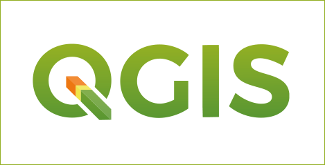

Exploring QGIS
==============

.. .. sectnum::

This exercise will introduce some of the basic features of QGIS. Along the way you will also become more familiar with QGIS.

About QGIS
----------

QGIS is a free and open source software you can download from `www.qgis.org
<http://www.qgis.org/>`_. and distribute through as many computers as you wish.

It is handy to bookmark the official `QGIS documentation <https://docs.qgis.org/testing/en/docs/user_manual//>`_.

Exercise
--------

.. admonition:: Resources

   | For this exercise you will need this `dataset <https://canvas.utwente.nl/files/1756885/download?download_frd=1/>`_. The dataset contains the following layers:

   - *admin_regions.gpkg* (vector layer containing the administrative regions of Guyana)
   - *rivers.gpkg* (vector layer containing the main rivers of Guyana)
   - *roads.gpkg* (vector layer containing the main roads of Guyana)

#. **Task** Start QGIS and add the three layers

#. **Task** Go to ``Plugins > Manage and install plugins...`` the plugin *Quick map services* and add one base map to your project.

#. **Task** In the ``Layer's panel`` create two groups (i.e. folders): one called *artifitial* and another one called *natural*

#. **Task** Drag the *admin_regions* and *roads* into the group *artificial* and the rivers layer into the group *natural*.

#. **Task** Re-order the groups and the layers inside in such a way that all the layers are visible.

#. **Task** Save your QGIS project and share it with a colleague.

#. **Task** Open a project created by a colleague.

#. **Task** Re-arrange one or two toolbars in a way that it is convenient.

#. **Task** Make sure the ``Processing panel`` is visible

