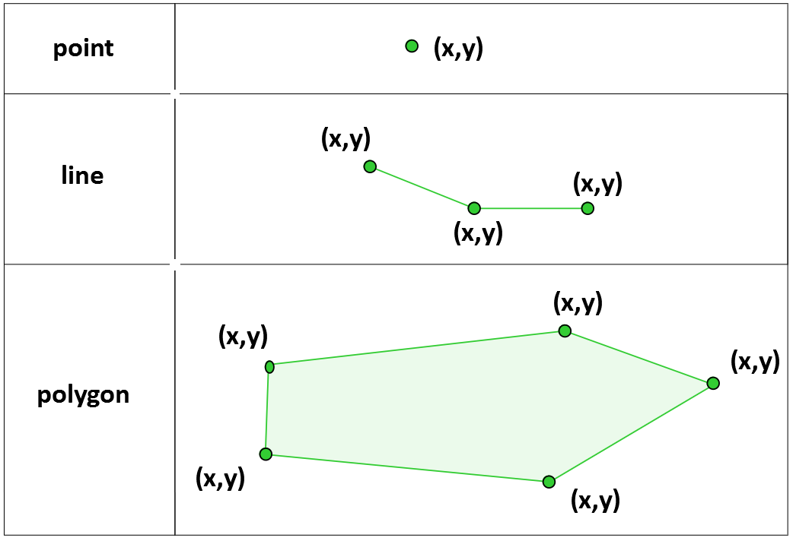
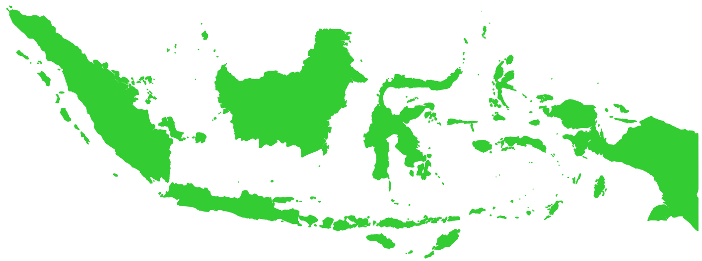

Vector representations
======================

A common way to represent real world objects in a GIS is using a vector data model to do it.
This exercise will introduce the basic concepts and rationale behind the vector model.

The vector model
----------------

The vector model uses the most basic geometric primitive - the point, to construct more complex geometries like lines and polygons (:numref:`The vector data model`).
Each point is defined by its X and Y coordinates in the case of 2D geometries and also a Z coordinate in the case of 3D geometries.

.. _The vector data model:

   The vector data model

The coordinates associated to the vector representations are anchored to a Coordinate Reference System (CRS), but this exercise is not covering CRS.
With these geometric constructs, one can abstract real world phenomena into computer representations (:numref:`Abstracting objects`).

.. _Abstracting objects:
.. figure:: _static/images/vector_representations/abstracting_objects.png
   :alt: abstracting_objects
   :scale: 50 %
   :figclass: align-center

   Abstracting objects

Along with the geometries, when abstracting real world objects or phenomena into a vector model, often we need to provide additional information
as to what those geometries represent, and how they are described. This set of information is known as the ``Atribute table``. Consider the example of the previous figure,
Can we know more about that road? The answer to that question lies on the attribute table associated with the geometry. That attribute table could be something like this:

+------------+---------+-----------+
| Name       | one-way | length(m) |
+============+=========+===========+
| M43        | no      | 7895      |
+------------+---------+-----------+

Multipart geometries
^^^^^^^^^^^^^^^^^^^^

A special, but very common case, occurs when you have an object that is composed of two or more parts. These parts form one single object and as such
in the attribute table only one entry will show. One classic example are multi island countries like Indonesia. Each island can be represented as a polygon, but all those polygons compose one single object (:numref:`Indonesia`).

.. _indonesia:

   Indonesia

Exercise
--------

.. admonition:: Resources

   | For this exercise you will only need a sheet of paper and a pen/pencil. You are encouraged to work together with a colleague.

Now that you are familiar with the vector data model, we invite you to abstract any real world object, man made or natural, into a vector data model.

#. **Task** Fill in the following table with any example you consider adequate:

   +-------------------------+-------------------+-----------------------------+
   | Real world object       | represented by a  | attributes(name at least 3) |
   +=========================+===================+=============================+
   | *restaurant*            | *Point*           | *name; rating; capacity*    |
   +-------------------------+-------------------+-----------------------------+
   |...                      |...                |...                          |
   +-------------------------+-------------------+-----------------------------+
   |...                      |...                |...                          |
   +-------------------------+-------------------+-----------------------------+
   |...                      |...                |...                          |
   +-------------------------+-------------------+-----------------------------+

   |
#. **Task** Provide at least two examples of objects that in principle most be represented by multi-part geometries
